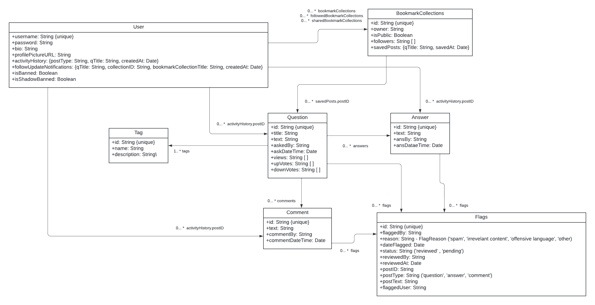

# MindSync Overview
MindSync is a platform focused on providing personalization and safety for users through 3 main features: user profiles, bookmarking, and content moderation.

The tech stack includes the following:
- Typescript
- React
- MongoDB
- Google Cloud Storage
- API Ninja's Profanity API

For deployment, Render was used.

## External Dependencies
The following project uses two external dependencies that need to be setup: Google Cloud Storage and API Ninja's Profanity API.

### Google Cloud Storage Bucket Setup
- Create or use an existing Google Account and sign up for Google Cloud Storage
- Enter your credit card information to get access to the free tiered version
- Once signed into the Google Cloud Storage Account, click the “Buckets” Tab on the lefthand side
- After clicking “Buckets”, click “Create”
- Create a name for the bucket, and leave all other settings as default, clicking “Create” at the end
- For the sake of the project, all objects in the Google Cloud bucket need to be publicly accessible in order to fetch and display profile images: Follow the steps below:
    - Open the Cloud Storage browser in the Google Cloud Platform Console.
    - In the list of buckets, click on the name of the bucket that you want to make public.
    - Select the Permissions tab near the top of the page.
    - Click the Add members button.
    - The Add members dialog box appears.
    - In the Members field, enter allUsers.
    - In the Roles drop down, select the Storage sub-menu, and click the Storage Object Viewer option.
    - Click Add.
- Follow the linked video for generating the API key to allow programmatic access to the Google Cloud Bucket: https://www.youtube.com/watch?v=pGSzMfKBV9Q&t=444s
- Note: For the project, the credentials for programmatic google cloud access are stored in the repository in server/googleCloudCredentials.json

### Profanity API
- The profanity API is found here: https://api-ninjas.com/api/profanityfilter 
- Sign up for an account on API Ninjas once you are on the site
- Create an API key for the Profanity API
- Note: the API key is stored in the source code in server/profanityFilter.ts

## Building

### Building and Running Locally
Refer to IP1 and IP2 for instructions related to setting up MongoDB, setting environment variables, and running the client and server.

For context:
- cd into the client directory and run the following command: **npm install**
- cd into the server directory and run the following command: **npm install**
- cd into the server directory and run the following command to start the server: **npm run start**
- cd into the client directory and run the following command to start the client in a web browser: **npm run start**

### Building and Running on Render Server
- In the backend/server service of the Render app, set the following server’s build command as the following (settings -> build command): **npm install && tsc && cp ../server/googleCloudCredentials.json dist/googleCloudCredentials.json**
- In the backend/server service of the Render app, set the following server’s start command as the following (settings -> start command): **npm run start:prod**

- In the client service of the Render app, set the following client’s build command as the following (settings -> build command): **npm install && npm run build**
- In the client service of the Render app, set the following client’s publish directory as the following (settings -> publish directory): **build**
- In the client service of the Render app, set the following rewrite rule (redirects/rewrites -> add rule)
    - Set source as: /*
    - Set destination as: /index.html
    - Set action as: Rewrite
    - Save the rule

## Database architecture
Below is a diagram of the database schema for the all the MongoDB objects, found in server/models/schema

